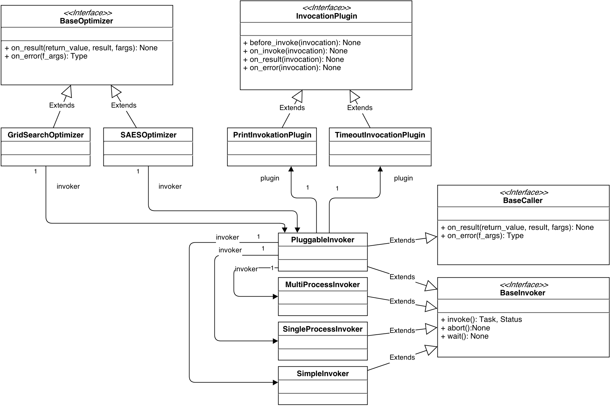

<!--\n\n\n will create a horizontal slide, \n\n will create a vertical slide -->

# OrgES

Organic Computing for Evolution Strategies

## Ziele

-   Blackbox-Optimierung von Fitness-Funktionen
-   Möglichst parallel, fehlertolerant und zeitig
-   Erstellung von eigenen Optimierungsverfahren
-   Erweiterbar durch den Nutzer in Form von Plugins

## Allgemeines

-   Als Bibliothek für Python 2.5 und später
-   Entwicklung auf GitHub ([cigroup-ol/orges](https://github.com/cigroup-ol/orges))
-   Verfügbar unter freier Lizenz (_3-Clause-BSD_)
-   Unit Testing, Integration Testing, CI etc.

## Fitness-Funktionen

    @param.float("a", interval=(0, 1), step=0.1, display_name="α")
    @param.float("b", interval=(-1, 1), step=0.2, display_name="β")
    @param.int("c", interval=(1, 100))
    def f(a, b, c):
        # Berechnung basierend auf a, b und c...
        return fitness_wert

Eine Funktion mit 3 Parametern a,b∊ℝ und c∊ℤ mit jeweils verschiedenen
Intervallen und Schrittgrößen.

## Parameteroptimierung

    @param.int("lamb", interval=(10, 100), display_name="λ")
    @param.int("mu", interval=(10, 100), display_name="μ")
    @param.float("mutation_rate", interval=(0.005, 0.01), display_name="p_m")
    def f(mu, lamb, mutation_rate):
        # Ausführung eines EA...
        return number_of_generations

Optimierung eines EA mit Parametern λ, μ und Mutationsrate, der die
Kugelfunktion optimiert.

## Optimierung

    >>> optimize(f, timeout=60) # Abbruch spätestens nach 60 Sekunden
    (α=0.5, β=0.7, c=55)

## Optimierer

Brute-Force (benötigt `step` für jeden Parameter)

    optimize(f, optimizer=GridSearchOptimizer())

Selbstadaptiver genetischer Algorithmus

    optimize(f, optimizer=SAESOptimizer())

### Optimierer-Framework (1/2)

    def optimize(self, f, ...):
        ...
        # Iterieren über alle möglichen Parameterbelegungen
        for args in args_creator.product():
            # Aufruf der Fitness-Funktion (parallel im Hintergrund)
            self.invoker.invoke(f, args)

        # Warten bis alle Aufrufe beendet sind
        self.invoker.wait()
        return self.best

### Optimierer-Framework (2/2)

    # Wird aufgerufen, wenn ein Aufruf beendet ist
    def on_result(self, result, args, *vargs):
        fitness = result
        _, best_fitness = self.best

        if best_fitness is None or fitness < best_fitness:
            self.best = (args, fitness)

## Invoker

-   Zuständig für den Aufruf der Fitness-Funktionen
-   Beliebige Aufruf-Strategien (Prozesse, Threads, verteilt)
-   Teil des Frameworks zur Erstellung von Optimierern

## API der Invoker

-  `invoke(f, args, ...)`
    Aufruf von Fitness-Funktion mit Parameterbelegung.
-   `wait()`
    Warten, bis alle Fitness-Funktionen beendet sind.
-   `abort(), cancel(task)`
    Aufrufe sofort beenden.
-   ``on_result(...)``, ``on_error(...)``
    Callbacks des Optimierer für Resultate von Aufrufen.

## Vorhandene Invoker

-   PluggableInvoker
    mit Andockstellen für Plugins
-   MultiProcessInvoker
    mit Ausführung in Python-Prozessen

## Ideen für weitere Invoker

-   MultiThreadedInvoker
    -   mit Ausführung in Threads
    -   für EA-beschränkte Algorithmen
-   DistributedInvoker
    -   mit Ausführung auf mehrere Maschinen
    -   für mehr Parallelisierung

## Architekturüberlick

-   `Optimizer`
    nutzen `Invoker`
-   `PluggableInvoker`
    nutzen `Plugins` und andere `Invoker`
-   `PluggableInvoker`
    sind sowohl `Caller` als auch `Invoker`

## PluggableInvoker

-   Erweiterbarer Invoker, der intern andere Invoker nutzt
-   Plugins verändern Aufrufe der Fitness-Funktion
-   Plugins durch Ereignise:
    ``on_invoke``, ``on_result``, ``on_error``

## TimeoutInvocationPlugin

Abbruch eines Aufrufs der Fitness-Funktion nach bestimmter Zeit

    class TimeoutInvocationPlugin(InvocationPlugin):
        def __init__(self, timeout):
            self.timeout = timeout

        def on_invoke(self, invocation):
            current_task = invocation.current_task
            Timer(self.timeout, current_task.cancel).start()

## PrintInvocationPlugin

Logging von Ereignissen auf der Konsole

    class PrintInvocationPlugin(InvocationPlugin):
        def on_invoke(self, invocation):
            print("Started", "f%s" % (invocation.fargs,))

        def on_result(self, invocation):
            result = invocation.current_result
            print("Finished", "f%s=%s" % (invocation.fargs, result))

        def on_error(self, invocation):
            print("Failed", "f%s" % (invocation.fargs,))

## PrintInvocationPlugin

Mögliche Ausgabe:

    Started f(α=0.7, β=0.9, a=5)
    Finished f(α=0.7, β=0.9, a=5)=0.3
    Started f(α=0.2, β=0.5, a=99)
    Failed f(α=0.2, β=0.5, a=99)

## Ideen für weitere Plugins

-   Visualisierung (z.B. Fitnesslandschaft)
-   Mehrfacher Aufruf der Fitness-Funktion
-   Speicherung von Zwischenergebnissen

## MultiProcessInvoker

Aufgabe

-   (selbstständige) Parallelisierung von
-   (beliebigen) Funktionsaufrufen mit
-   (beliebigen) Argumenten

&nbsp;

Ansatz

`>>> import multiprocess`

# Probleme & Lösungen

## IPC (1/3)

-   Inter-Prozess-Kommunikation (IPC) nötig
    &rArr; WorkerProcess und der Invoker teilen sich Queues:
    -   tasks: eingehende Aufträge
    -   status: Auftragsbesätigungen
    -   results: (Zwischen-)Ergebnisse

&nbsp;

    class MultiProcessInvoker(BaseInvoker):
        def __init__(self, resources=None):
            self._queue_results = Queue()
            self._queue_status = Queue()
            self._queue_tasks = Queue()

&nbsp;

    class WorkerProcess(Process):
        def __init__(self, queue_results, queue_status, queue_tasks):
            self._queue_results = queue_results
            self._queue_status = queue_status
            self._queue_tasks = queue_tasks

## IPC (2/3)

-   Worker-Management würde Polling erfordern
    &rArr; Synchronisation über `Queue`s

&nbsp;

    self._queue_tasks.put(Task(...))
    # some worker will get the task and report back before executing
    status = self._queue_status.get()

## IPC (3/3)

-   Funktionen nicht `pickle`bar
    &rArr; `import`s übergeben

&nbsp;

    for task in self.queue_tasks.get:
        ...
        f = __import__(task.f_package, globals(), locals(), ['f'], -1).f
        value = call(f, task.args)

## Prozesse

-   Worker-Prozesse erzeugen ist recht teuer
    &rArr; WorkerPool hält WorkerProzesse bereit
-   Worker und Tasks müssen identifiziert werden
    &rArr; bei Erzeugung `uuid`s vergeben

&nbsp;

    def _provision_worker(self):
        if len(self._worker_processes) is not self.worker_count_max:
            id = uuid.uuid4()
            self._worker_processes.append(self._get_worker_process(id))

# Demo

# v0.0.1

-   mehr Tests
    aktuell: 69 % coverage
-   mehr Beispiele
    aktuell: 8
-   mehr Invoker
    aktuell: 3
-   mehr Plugins
    aktuell: 2

# The End

